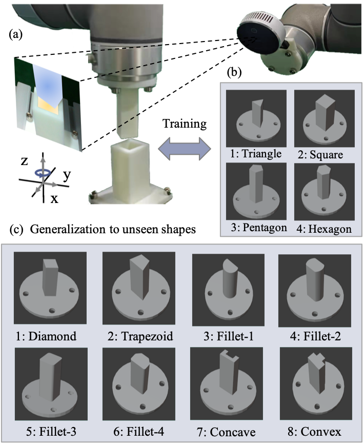
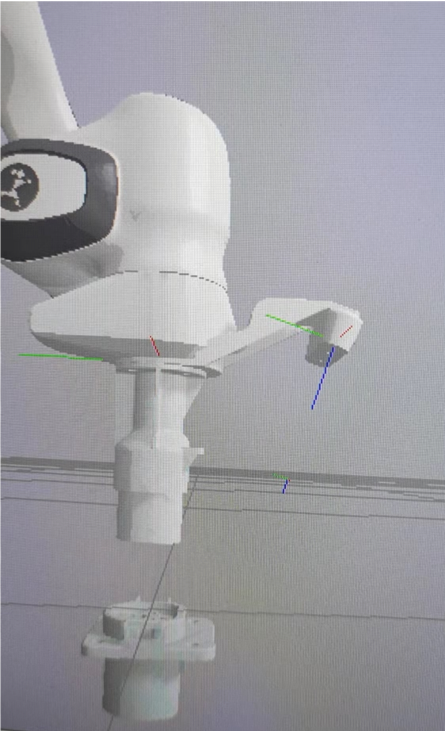
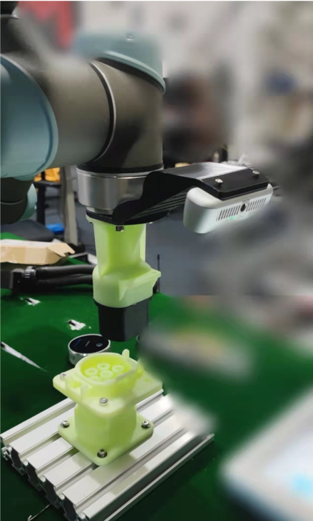

# Precision Peg-in-hole

Peg-in-hole is essential in both industrial and service robots. Compared with the force-based methods, the vision-based methods make less object contact and perform better convergence under large initial error, but show worse generalization to new objects with unseen shapes. This paper proposes a visual peg-in-hole framework that enables training with several shapes in simulation, and adapting to arbitrary unseen shapes in real world with minimal sim-to-real cost. The core idea is to decouple the generalization of the sensory-motor policy to the design of a fast-adaptable perception module and a simulation-based generic policy module. The framework consists of a segmentation network (SN), a virtual sensor network (VSN), and a controller network (CN). Concretely, the VSN is trained in simulation to measure the peg-hole pose from a peg-hole segmented image, of which the generalization is achieved by inductive bias in architecture. After that, given the shape-agnostic pose measurement, the CN is trained to achieve generic peg-in-hole in simulation. Finally, when applying to real-world unseen holes, we only have to fine-tune the SN for image segmentation required by VSN+CN in real-world peg-in-hole. To further minimize the transfer cost, we propose to automatically collect and annotate the segmentation training data after one-minute human teaching. We deploy the above policy to two typical configurations i.e. eye-in-hand and eye-to-hand, and compare it with a traditional method and the learning-based end-to-end methods on 8 simulated and real unseen holes, exhibiting superior success rate, insertion efficiency, and generalization. At last, an electric vehicle (EV) charging system with the proposed policy inside, achieves a 10/10 success rate in about 3s, using only hundreds of auto-labeled samples for segmentation transfer. 

    </img>

 

## Automatic data collection and annotation
The sim2real adaptation is achieved by fine-tunning for the SN, with the training data (image+segmentation mask) collected and annotated automaticly. The data collection and model training can be achieved efficiently within 30mins in real world.

    </img>

 

## Real world experiments
**Generalization:** the proposed framework generalizes well on different seen and unseen 3D-printed models with sub-millimeter tolerance.

    

        
    

**Robustness:** the hole base can be either fixed (static insertion) or under disturbance (dynamic insertion).
<!-- The proposed method generalizes well on the eye-in-hand experiment setting, where the camera is fixed on the robot end-effector and follows up with the robot. The hole base can be either fixed or under disturbance. -->

    

<!--          -->
<!--          -->
        
        
    

## EV charging application

    

        
        
    

    

        <figure>
                
                
            <figcaption>a</figcaption>
        </figure>
    

|  |  |
|:--:|:--:|
|(a)|(b)|
|  | {width=40%} |
|(c)|(d)|

## Downloads
arXiv: [[SFN](https://arxiv.org/abs/2204.07776)] [[VSN](https://arxiv.org/abs/2205.04297)]
